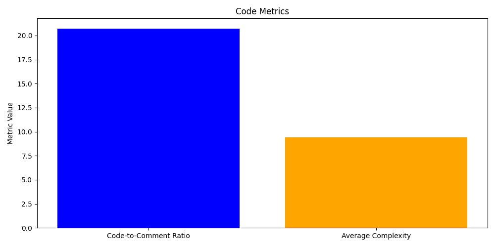
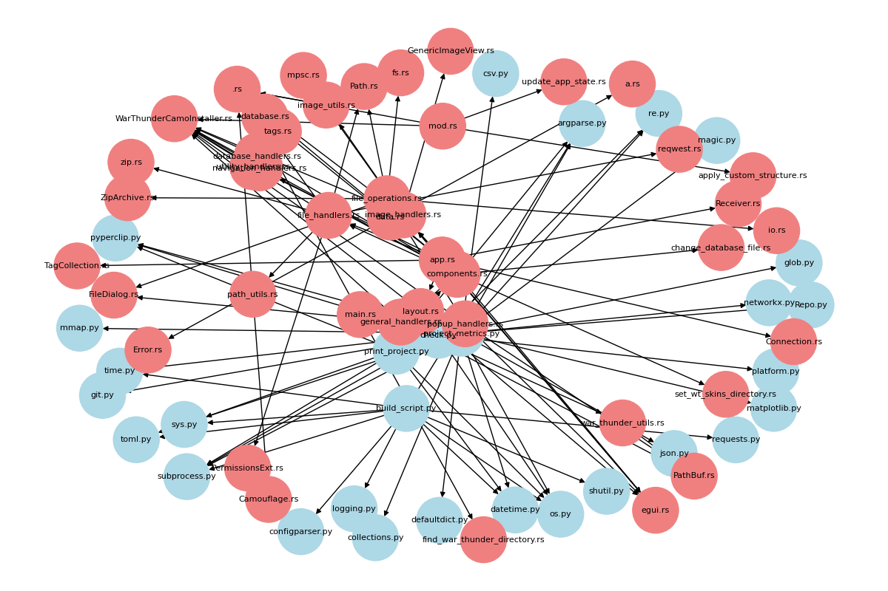
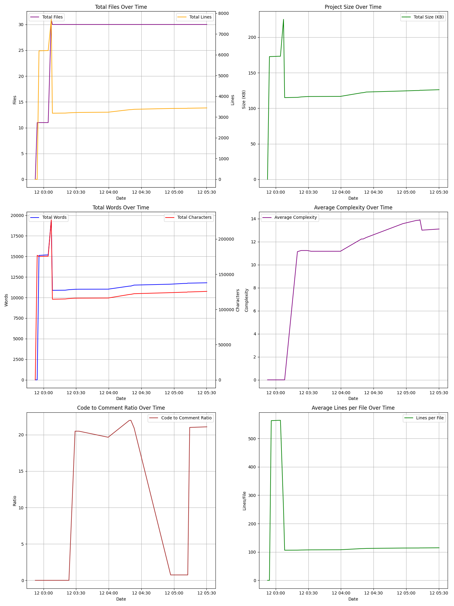

# Project Metrics Summary

## Overview
- **Total Files:** 32
- **Total Lines:** 2406
- **Total Words:** 10127
- **Total Characters:** 102790
- **Total Size:** 102.82 KB
- **Code to Comment Ratio:** 5.00
- **Average Complexity:** 5.46
- **Detected License:** License file not found

## File Type Statistics

| Extension | Files | Lines | Words | Characters | Size |
|-----------|-------|-------|-------|------------|------|
| .rs | 21 | 1599 | 4468 | 54259 | 54.54 KB |
| .md | 5 | 499 | 4524 | 38664 | 38.35 KB |
| .py | 1 | 211 | 831 | 7603 | 7.63 KB |
| .log | 1 | 45 | 175 | 1273 | 1.29 KB |
| .toml | 1 | 28 | 98 | 636 | 664.00 B |
| [no extension] | 2 | 23 | 28 | 326 | 348.00 B |
| .bat | 1 | 1 | 3 | 29 | 30.00 B |

## Dependencies

- eframe: {'version': '0.22.0', 'features': ['persistence']}
- egui: 0.22.0
- rusqlite: {'version': '0.29.0', 'features': ['bundled']}
- ehttp: 0.2.0
- image: 0.24.6
- base64: 0.21.0
- rfd: 0.9
- zip: 0.5
- reqwest: {'version': '0.11', 'features': ['blocking']}
- tempfile: 3.3
- thiserror: 1.0
- parking_lot: 0.12
- dirs: 5.0
- rayon: 1.5
- serde: {'version': '1.0', 'features': ['derive']}
- serde_json: 1.0
- native-dialog: 0.6.3

## TODOs and FIXMEs

- .\docs/METRICS.md:46: ## TODOs and FIXMEs
- .\docs/METRICS.md:48: - .\build_script.py:187: "TODO.md": "todo list",
- .\docs/METRICS.md:49: - .\build_script.py:218: code, output, _ = run_command(f"git diff {remote_branch} -- src/ Cargo.toml CHANGE.log TODO.md README.md", verbose=True)
- .\docs/METRICS.md:50: - .\build_script.py:271: Based on the following changes in the source files, Cargo.toml, CHANGE.log, TODO.md, and README.md,
- .\docs/METRICS.md:51: - .\build_script.py:278: - Revised TODO.md, removing completed tasks and adding new features.
- .\docs/METRICS.md:52: - .\build_script.py:414: """Update the README.md, TODO.md, and CHANGE.log with new changes."""
- .\docs/METRICS.md:53: - .\build_script.py:422: "TODO.md": "ToDo List",
- .\docs/METRICS.md:54: - .\build_script.py:441: subprocess.run(["git", "add", "README.md", "TODO.md", "CHANGE.log"], check=True)
- .\docs/METRICS.md:55: - .\docs/METRICS.md:46: ## TODOs and FIXMEs
- .\docs/METRICS.md:56: - .\docs/METRICS.md:48: - .\build_script.py:187: "TODO.md": "todo list",
- .\docs/METRICS.md:57: - .\docs/METRICS.md:49: - .\build_script.py:218: code, output, _ = run_command(f"git diff {remote_branch} -- src/ Cargo.toml CHANGE.log TODO.md README.md", verbose=True)
- .\docs/METRICS.md:58: - .\docs/METRICS.md:50: - .\build_script.py:271: Based on the following changes in the source files, Cargo.toml, CHANGE.log, TODO.md, and README.md,
- .\docs/METRICS.md:59: - .\docs/METRICS.md:51: - .\build_script.py:278: - Revised TODO.md, removing completed tasks and adding new features.
- .\docs/METRICS.md:60: - .\docs/METRICS.md:52: - .\build_script.py:414: """Update the README.md, TODO.md, and CHANGE.log with new changes."""
- .\docs/METRICS.md:61: - .\docs/METRICS.md:53: - .\build_script.py:422: "TODO.md": "ToDo List",
- .\docs/METRICS.md:62: - .\docs/METRICS.md:54: - .\build_script.py:441: subprocess.run(["git", "add", "README.md", "TODO.md", "CHANGE.log"], check=True)
- .\docs/METRICS.md:63: - .\docs/METRICS.md:55: - .\docs/METRICS.md:46: ## TODOs and FIXMEs
- .\docs/METRICS.md:64: - .\docs/METRICS.md:56: - .\docs/METRICS.md:48: - .\build_script.py:187: "TODO.md": "todo list",
- .\docs/METRICS.md:65: - .\docs/METRICS.md:57: - .\docs/METRICS.md:49: - .\build_script.py:218: code, output, _ = run_command(f"git diff {remote_branch} -- src/ Cargo.toml CHANGE.log TODO.md README.md", verbose=True)
- .\docs/METRICS.md:66: - .\docs/METRICS.md:58: - .\docs/METRICS.md:50: - .\build_script.py:271: Based on the following changes in the source files, Cargo.toml, CHANGE.log, TODO.md, and README.md,
- .\docs/METRICS.md:67: - .\docs/METRICS.md:59: - .\docs/METRICS.md:51: - .\build_script.py:278: - Revised TODO.md, removing completed tasks and adding new features.
- .\docs/METRICS.md:68: - .\docs/METRICS.md:60: - .\docs/METRICS.md:52: - .\build_script.py:414: """Update the README.md, TODO.md, and CHANGE.log with new changes."""
- .\docs/METRICS.md:69: - .\docs/METRICS.md:61: - .\docs/METRICS.md:53: - .\build_script.py:422: "TODO.md": "ToDo List",
- .\docs/METRICS.md:70: - .\docs/METRICS.md:62: - .\docs/METRICS.md:54: - .\build_script.py:441: subprocess.run(["git", "add", "README.md", "TODO.md", "CHANGE.log"], check=True)
- .\docs/METRICS.md:71: - .\docs/METRICS.md:63: - .\docs/METRICS.md:55: - .\docs/METRICS.md:46: ## TODOs and FIXMEs
- .\docs/METRICS.md:72: - .\docs/METRICS.md:64: - .\docs/METRICS.md:56: - .\docs/METRICS.md:48: - .\build_script.py:187: "TODO.md": "todo list",
- .\docs/METRICS.md:73: - .\docs/METRICS.md:65: - .\docs/METRICS.md:57: - .\docs/METRICS.md:49: - .\build_script.py:218: code, output, _ = run_command(f"git diff {remote_branch} -- src/ Cargo.toml CHANGE.log TODO.md README.md", verbose=True)
- .\docs/METRICS.md:74: - .\docs/METRICS.md:66: - .\docs/METRICS.md:58: - .\docs/METRICS.md:50: - .\build_script.py:271: Based on the following changes in the source files, Cargo.toml, CHANGE.log, TODO.md, and README.md,
- .\docs/METRICS.md:75: - .\docs/METRICS.md:67: - .\docs/METRICS.md:59: - .\docs/METRICS.md:51: - .\build_script.py:278: - Revised TODO.md, removing completed tasks and adding new features.
- .\docs/METRICS.md:76: - .\docs/METRICS.md:68: - .\docs/METRICS.md:60: - .\docs/METRICS.md:52: - .\build_script.py:414: """Update the README.md, TODO.md, and CHANGE.log with new changes."""
- .\docs/METRICS.md:77: - .\docs/METRICS.md:69: - .\docs/METRICS.md:61: - .\docs/METRICS.md:53: - .\build_script.py:422: "TODO.md": "ToDo List",
- .\docs/METRICS.md:78: - .\docs/METRICS.md:70: - .\docs/METRICS.md:62: - .\docs/METRICS.md:54: - .\build_script.py:441: subprocess.run(["git", "add", "README.md", "TODO.md", "CHANGE.log"], check=True)
- .\docs/METRICS.md:79: - .\docs/METRICS.md:71: - .\docs/METRICS.md:63: - .\docs/METRICS.md:55: - .\project_metrics.py:239: """Find TODO and FIXME comments in files."""
- .\docs/METRICS.md:80: - .\docs/METRICS.md:72: - .\docs/METRICS.md:64: - .\docs/METRICS.md:56: - .\project_metrics.py:244: if 'TODO' in line or 'FIXME' in line:
- .\docs/METRICS.md:81: - .\docs/METRICS.md:73: - .\docs/METRICS.md:65: - .\docs/METRICS.md:57: - .\project_metrics.py:668: print("\nTODOs and FIXMEs:")
- .\docs/METRICS.md:82: - .\docs/METRICS.md:74: - .\docs/METRICS.md:66: - .\docs/METRICS.md:58: - .\project_metrics.py:713: ## TODOs and FIXMEs
- .\docs/METRICS.md:83: - .\docs/METRICS.md:75: - .\docs/METRICS.md:67: - .\docs/METRICS.md:59: - .\docs\METRICS.md:46: ## TODOs and FIXMEs
- .\docs/METRICS.md:84: - .\docs/METRICS.md:76: - .\docs/METRICS.md:68: - .\docs/METRICS.md:60: - .\docs\METRICS.md:48: - .\build_script.py:187: "TODO.md": "todo list",
- .\docs/METRICS.md:85: - .\docs/METRICS.md:77: - .\docs/METRICS.md:69: - .\docs/METRICS.md:61: - .\docs\METRICS.md:49: - .\build_script.py:218: code, output, _ = run_command(f"git diff {remote_branch} -- src/ Cargo.toml CHANGE.log TODO.md README.md", verbose=True)
- .\docs/METRICS.md:86: - .\docs/METRICS.md:78: - .\docs/METRICS.md:70: - .\docs/METRICS.md:62: - .\docs\METRICS.md:50: - .\build_script.py:271: Based on the following changes in the source files, Cargo.toml, CHANGE.log, TODO.md, and README.md,
- .\docs/METRICS.md:87: - .\docs/METRICS.md:79: - .\docs/METRICS.md:71: - .\docs/METRICS.md:63: - .\docs\METRICS.md:51: - .\build_script.py:278: - Revised TODO.md, removing completed tasks and adding new features.
- .\docs/METRICS.md:88: - .\docs/METRICS.md:80: - .\docs/METRICS.md:72: - .\docs/METRICS.md:64: - .\docs\METRICS.md:52: - .\build_script.py:414: """Update the README.md, TODO.md, and CHANGE.log with new changes."""
- .\docs/METRICS.md:89: - .\docs/METRICS.md:81: - .\docs/METRICS.md:73: - .\docs/METRICS.md:65: - .\docs\METRICS.md:53: - .\build_script.py:422: "TODO.md": "ToDo List",
- .\docs/METRICS.md:90: - .\docs/METRICS.md:82: - .\docs/METRICS.md:74: - .\docs/METRICS.md:66: - .\docs\METRICS.md:54: - .\build_script.py:441: subprocess.run(["git", "add", "README.md", "TODO.md", "CHANGE.log"], check=True)
- .\docs/METRICS.md:91: - .\docs/METRICS.md:83: - .\docs/METRICS.md:75: - .\docs/METRICS.md:67: - .\docs\METRICS.md:55: - .\project_metrics.py:239: """Find TODO and FIXME comments in files."""
- .\docs/METRICS.md:92: - .\docs/METRICS.md:84: - .\docs/METRICS.md:76: - .\docs/METRICS.md:68: - .\docs\METRICS.md:56: - .\project_metrics.py:244: if 'TODO' in line or 'FIXME' in line:
- .\docs/METRICS.md:93: - .\docs/METRICS.md:85: - .\docs/METRICS.md:77: - .\docs/METRICS.md:69: - .\docs\METRICS.md:57: - .\project_metrics.py:668: print("\nTODOs and FIXMEs:")
- .\docs/METRICS.md:94: - .\docs/METRICS.md:86: - .\docs/METRICS.md:78: - .\docs/METRICS.md:70: - .\docs\METRICS.md:58: - .\project_metrics.py:713: ## TODOs and FIXMEs
- .\docs/METRICS.md:95: - .\docs/METRICS.md:87: - .\docs/METRICS.md:79: - .\docs/METRICS.md:71: - .\docs\METRICS.md:59: - .\docs\METRICS.md:46: ## TODOs and FIXMEs
- .\docs/METRICS.md:96: - .\docs/METRICS.md:88: - .\docs/METRICS.md:80: - .\docs/METRICS.md:72: - .\docs\METRICS.md:60: - .\docs\METRICS.md:48: - .\build_script.py:187: "TODO.md": "todo list",
- .\docs/METRICS.md:97: - .\docs/METRICS.md:89: - .\docs/METRICS.md:81: - .\docs/METRICS.md:73: - .\docs\METRICS.md:61: - .\docs\METRICS.md:49: - .\build_script.py:218: code, output, _ = run_command(f"git diff {remote_branch} -- src/ Cargo.toml CHANGE.log TODO.md README.md", verbose=True)
- .\docs/METRICS.md:98: - .\docs/METRICS.md:90: - .\docs/METRICS.md:82: - .\docs/METRICS.md:74: - .\docs\METRICS.md:62: - .\docs\METRICS.md:50: - .\build_script.py:271: Based on the following changes in the source files, Cargo.toml, CHANGE.log, TODO.md, and README.md,
- .\docs/METRICS.md:99: - .\docs/METRICS.md:91: - .\docs/METRICS.md:83: - .\docs/METRICS.md:75: - .\docs\METRICS.md:63: - .\docs\METRICS.md:51: - .\build_script.py:278: - Revised TODO.md, removing completed tasks and adding new features.
- .\docs/METRICS.md:100: - .\docs/METRICS.md:92: - .\docs/METRICS.md:84: - .\docs/METRICS.md:76: - .\docs\METRICS.md:64: - .\docs\METRICS.md:52: - .\build_script.py:414: """Update the README.md, TODO.md, and CHANGE.log with new changes."""
- .\docs/METRICS.md:101: - .\docs/METRICS.md:93: - .\docs/METRICS.md:85: - .\docs/METRICS.md:77: - .\docs\METRICS.md:65: - .\docs\METRICS.md:53: - .\build_script.py:422: "TODO.md": "ToDo List",
- .\docs/METRICS.md:102: - .\docs/METRICS.md:94: - .\docs/METRICS.md:86: - .\docs/METRICS.md:78: - .\docs\METRICS.md:66: - .\docs\METRICS.md:54: - .\build_script.py:441: subprocess.run(["git", "add", "README.md", "TODO.md", "CHANGE.log"], check=True)
- .\docs/METRICS.md:103: - .\docs/METRICS.md:95: - .\docs/METRICS.md:87: - .\docs/METRICS.md:79: - .\docs\METRICS.md:67: - .\docs\METRICS.md:55: - .\project_metrics.py:239: """Find TODO and FIXME comments in files."""
- .\docs/METRICS.md:104: - .\docs/METRICS.md:96: - .\docs/METRICS.md:88: - .\docs/METRICS.md:80: - .\docs\METRICS.md:68: - .\docs\METRICS.md:56: - .\project_metrics.py:244: if 'TODO' in line or 'FIXME' in line:
- .\docs/METRICS.md:105: - .\docs/METRICS.md:97: - .\docs/METRICS.md:89: - .\docs/METRICS.md:81: - .\docs\METRICS.md:69: - .\docs\METRICS.md:57: - .\project_metrics.py:622: print("\nTODOs and FIXMEs:")
- .\docs/METRICS.md:106: - .\docs/METRICS.md:98: - .\docs/METRICS.md:90: - .\docs/METRICS.md:82: - .\docs\METRICS.md:70: - .\docs\METRICS.md:58: - .\project_metrics.py:667: ## TODOs and FIXMEs
- .\docs/METRICS.md:107: - .\docs/METRICS.md:99: - .\docs/METRICS.md:91: - .\docs/METRICS.md:83: - .\docs\METRICS.md:71: - .\docs\METRICS.md:59: - .\docs\METRICS.md:46: ## TODOs and FIXMEs
- .\docs/METRICS.md:108: - .\docs/METRICS.md:100: - .\docs/METRICS.md:92: - .\docs/METRICS.md:84: - .\docs\METRICS.md:72: - .\docs\METRICS.md:60: - .\docs\METRICS.md:48: - .\build_script.py:187: "TODO.md": "todo list",
- .\docs/METRICS.md:109: - .\docs/METRICS.md:101: - .\docs/METRICS.md:93: - .\docs/METRICS.md:85: - .\docs\METRICS.md:73: - .\docs\METRICS.md:61: - .\docs\METRICS.md:49: - .\build_script.py:218: code, output, _ = run_command(f"git diff {remote_branch} -- src/ Cargo.toml CHANGE.log TODO.md README.md", verbose=True)
- .\docs/METRICS.md:110: - .\docs/METRICS.md:102: - .\docs/METRICS.md:94: - .\docs/METRICS.md:86: - .\docs\METRICS.md:74: - .\docs\METRICS.md:62: - .\docs\METRICS.md:50: - .\build_script.py:271: Based on the following changes in the source files, Cargo.toml, CHANGE.log, TODO.md, and README.md,
- .\docs/METRICS.md:111: - .\docs/METRICS.md:103: - .\docs/METRICS.md:95: - .\docs/METRICS.md:87: - .\docs\METRICS.md:75: - .\docs\METRICS.md:63: - .\docs\METRICS.md:51: - .\build_script.py:278: - Revised TODO.md, removing completed tasks and adding new features.
- .\docs/METRICS.md:112: - .\docs/METRICS.md:104: - .\docs/METRICS.md:96: - .\docs/METRICS.md:88: - .\docs\METRICS.md:76: - .\docs\METRICS.md:64: - .\docs\METRICS.md:52: - .\build_script.py:414: """Update the README.md, TODO.md, and CHANGE.log with new changes."""
- .\docs/METRICS.md:113: - .\docs/METRICS.md:105: - .\docs/METRICS.md:97: - .\docs/METRICS.md:89: - .\docs\METRICS.md:77: - .\docs\METRICS.md:65: - .\docs\METRICS.md:53: - .\build_script.py:422: "TODO.md": "ToDo List",
- .\docs/METRICS.md:114: - .\docs/METRICS.md:106: - .\docs/METRICS.md:98: - .\docs/METRICS.md:90: - .\docs\METRICS.md:78: - .\docs\METRICS.md:66: - .\docs\METRICS.md:54: - .\build_script.py:441: subprocess.run(["git", "add", "README.md", "TODO.md", "CHANGE.log"], check=True)
- .\docs/METRICS.md:115: - .\docs/METRICS.md:107: - .\docs/METRICS.md:99: - .\docs/METRICS.md:91: - .\docs\METRICS.md:79: - .\docs\METRICS.md:67: - .\docs\METRICS.md:55: - .\project_metrics.py:236: """Find TODO and FIXME comments in files."""
- .\docs/METRICS.md:116: - .\docs/METRICS.md:108: - .\docs/METRICS.md:100: - .\docs/METRICS.md:92: - .\docs\METRICS.md:80: - .\docs\METRICS.md:68: - .\docs\METRICS.md:56: - .\project_metrics.py:241: if 'TODO' in line or 'FIXME' in line:
- .\docs/METRICS.md:117: - .\docs/METRICS.md:109: - .\docs/METRICS.md:101: - .\docs/METRICS.md:93: - .\docs\METRICS.md:81: - .\docs\METRICS.md:69: - .\docs\METRICS.md:57: - .\project_metrics.py:619: print("\nTODOs and FIXMEs:")
- .\docs/METRICS.md:118: - .\docs/METRICS.md:110: - .\docs/METRICS.md:102: - .\docs/METRICS.md:94: - .\docs\METRICS.md:82: - .\docs\METRICS.md:70: - .\docs\METRICS.md:58: - .\project_metrics.py:664: ## TODOs and FIXMEs
- .\docs/METRICS.md:119: - .\docs/METRICS.md:111: - .\docs/METRICS.md:103: - .\docs/METRICS.md:95: - .\docs\METRICS.md:83: - .\docs\METRICS.md:71: - .\docs\METRICS.md:59: - .\docs\METRICS.md:52: ## TODOs and FIXMEs
- .\docs/METRICS.md:120: - .\docs/METRICS.md:112: - .\docs/METRICS.md:104: - .\docs/METRICS.md:96: - .\docs\METRICS.md:84: - .\docs\METRICS.md:72: - .\docs\METRICS.md:60: - .\docs\METRICS.md:54: - .\build_script.py:187: "TODO.md": "todo list",
- .\docs/METRICS.md:121: - .\docs/METRICS.md:113: - .\docs/METRICS.md:105: - .\docs/METRICS.md:97: - .\docs\METRICS.md:85: - .\docs\METRICS.md:73: - .\docs\METRICS.md:61: - .\docs\METRICS.md:55: - .\build_script.py:218: code, output, _ = run_command(f"git diff {remote_branch} -- src/ Cargo.toml CHANGE.log TODO.md README.md", verbose=True)
- .\docs/METRICS.md:122: - .\docs/METRICS.md:114: - .\docs/METRICS.md:106: - .\docs/METRICS.md:98: - .\docs\METRICS.md:86: - .\docs\METRICS.md:74: - .\docs\METRICS.md:62: - .\docs\METRICS.md:56: - .\build_script.py:271: Based on the following changes in the source files, Cargo.toml, CHANGE.log, TODO.md, and README.md,
- .\docs/METRICS.md:123: - .\docs/METRICS.md:115: - .\docs/METRICS.md:107: - .\docs/METRICS.md:99: - .\docs\METRICS.md:87: - .\docs\METRICS.md:75: - .\docs\METRICS.md:63: - .\docs\METRICS.md:57: - .\build_script.py:278: - Revised TODO.md, removing completed tasks and adding new features.
- .\docs/METRICS.md:124: - .\docs/METRICS.md:116: - .\docs/METRICS.md:108: - .\docs/METRICS.md:100: - .\docs\METRICS.md:88: - .\docs\METRICS.md:76: - .\docs\METRICS.md:64: - .\docs\METRICS.md:58: - .\build_script.py:414: """Update the README.md, TODO.md, and CHANGE.log with new changes."""
- .\docs/METRICS.md:125: - .\docs/METRICS.md:117: - .\docs/METRICS.md:109: - .\docs/METRICS.md:101: - .\docs\METRICS.md:89: - .\docs\METRICS.md:77: - .\docs\METRICS.md:65: - .\docs\METRICS.md:59: - .\build_script.py:422: "TODO.md": "ToDo List",
- .\docs/METRICS.md:126: - .\docs/METRICS.md:118: - .\docs/METRICS.md:110: - .\docs/METRICS.md:102: - .\docs\METRICS.md:90: - .\docs\METRICS.md:78: - .\docs\METRICS.md:66: - .\docs\METRICS.md:60: - .\build_script.py:441: subprocess.run(["git", "add", "README.md", "TODO.md", "CHANGE.log"], check=True)
- .\docs/METRICS.md:127: - .\docs/METRICS.md:119: - .\docs/METRICS.md:111: - .\docs/METRICS.md:103: - .\docs\METRICS.md:91: - .\docs\METRICS.md:79: - .\docs\METRICS.md:67: - .\docs\METRICS.md:61: - .\project_metrics.py:236: """Find TODO and FIXME comments in files."""
- .\docs/METRICS.md:128: - .\docs/METRICS.md:120: - .\docs/METRICS.md:112: - .\docs/METRICS.md:104: - .\docs\METRICS.md:92: - .\docs\METRICS.md:80: - .\docs\METRICS.md:68: - .\docs\METRICS.md:62: - .\project_metrics.py:241: if 'TODO' in line or 'FIXME' in line:
- .\docs/METRICS.md:129: - .\docs/METRICS.md:121: - .\docs/METRICS.md:113: - .\docs/METRICS.md:105: - .\docs\METRICS.md:93: - .\docs\METRICS.md:81: - .\docs\METRICS.md:69: - .\docs\METRICS.md:63: - .\project_metrics.py:619: print("\nTODOs and FIXMEs:")
- .\docs/METRICS.md:130: - .\docs/METRICS.md:122: - .\docs/METRICS.md:114: - .\docs/METRICS.md:106: - .\docs\METRICS.md:94: - .\docs\METRICS.md:82: - .\docs\METRICS.md:70: - .\docs\METRICS.md:64: - .\project_metrics.py:664: ## TODOs and FIXMEs
- .\docs/METRICS.md:131: - .\docs/METRICS.md:123: - .\docs/METRICS.md:115: - .\docs/METRICS.md:107: - .\docs\METRICS.md:95: - .\docs\METRICS.md:83: - .\docs\METRICS.md:71: - .\docs\METRICS.md:65: - .\.git\hooks\sendemail-validate.sample:22: # Replace the TODO placeholders with appropriate checks according to your
- .\docs/METRICS.md:132: - .\docs/METRICS.md:124: - .\docs/METRICS.md:116: - .\docs/METRICS.md:108: - .\docs\METRICS.md:96: - .\docs\METRICS.md:84: - .\docs\METRICS.md:72: - .\docs\METRICS.md:66: - .\.git\hooks\sendemail-validate.sample:27: # TODO: Replace with appropriate checks (e.g. spell checking).
- .\docs/METRICS.md:133: - .\docs/METRICS.md:125: - .\docs/METRICS.md:117: - .\docs/METRICS.md:109: - .\docs\METRICS.md:97: - .\docs\METRICS.md:85: - .\docs\METRICS.md:73: - .\docs\METRICS.md:67: - .\.git\hooks\sendemail-validate.sample:35: # TODO: Replace with appropriate checks for this patch
- .\docs/METRICS.md:134: - .\docs/METRICS.md:126: - .\docs/METRICS.md:118: - .\docs/METRICS.md:110: - .\docs\METRICS.md:98: - .\docs\METRICS.md:86: - .\docs\METRICS.md:74: - .\docs\METRICS.md:68: - .\.git\hooks\sendemail-validate.sample:41: # TODO: Replace with appropriate checks for the whole series
- .\docs/METRICS.md:135: - .\docs/METRICS.md:127: - .\docs/METRICS.md:119: - .\docs/METRICS.md:111: - .\docs\METRICS.md:99: - .\docs\METRICS.md:87: - .\docs\METRICS.md:75: - .\docs\METRICS.md:69: - .\docs\METRICS.md:42: ## TODOs and FIXMEs
- .\docs/METRICS.md:136: - .\docs/METRICS.md:128: - .\docs/METRICS.md:120: - .\docs/METRICS.md:112: - .\docs\METRICS.md:100: - .\docs\METRICS.md:88: - .\docs\METRICS.md:76: - .\docs\METRICS.md:70: - .\docs\METRICS.md:44: - .\build_script.py:187: "TODO.md": "todo list",
- .\docs/METRICS.md:137: - .\docs/METRICS.md:129: - .\docs/METRICS.md:121: - .\docs/METRICS.md:113: - .\docs\METRICS.md:101: - .\docs\METRICS.md:89: - .\docs\METRICS.md:77: - .\docs\METRICS.md:71: - .\docs\METRICS.md:45: - .\build_script.py:218: code, output, _ = run_command(f"git diff {remote_branch} -- src/ Cargo.toml CHANGE.log TODO.md README.md", verbose=True)
- .\docs/METRICS.md:138: - .\docs/METRICS.md:130: - .\docs/METRICS.md:122: - .\docs/METRICS.md:114: - .\docs\METRICS.md:102: - .\docs\METRICS.md:90: - .\docs\METRICS.md:78: - .\docs\METRICS.md:72: - .\docs\METRICS.md:46: - .\build_script.py:271: Based on the following changes in the source files, Cargo.toml, CHANGE.log, TODO.md, and README.md,
- .\docs/METRICS.md:139: - .\docs/METRICS.md:131: - .\docs/METRICS.md:123: - .\docs/METRICS.md:115: - .\docs\METRICS.md:103: - .\docs\METRICS.md:91: - .\docs\METRICS.md:79: - .\docs\METRICS.md:73: - .\docs\METRICS.md:47: - .\build_script.py:278: - Revised TODO.md, removing completed tasks and adding new features.
- .\docs/METRICS.md:140: - .\docs/METRICS.md:132: - .\docs/METRICS.md:124: - .\docs/METRICS.md:116: - .\docs\METRICS.md:104: - .\docs\METRICS.md:92: - .\docs\METRICS.md:80: - .\docs\METRICS.md:74: - .\docs\METRICS.md:48: - .\build_script.py:414: """Update the README.md, TODO.md, and CHANGE.log with new changes."""
- .\docs/METRICS.md:141: - .\docs/METRICS.md:133: - .\docs/METRICS.md:125: - .\docs/METRICS.md:117: - .\docs\METRICS.md:105: - .\docs\METRICS.md:93: - .\docs\METRICS.md:81: - .\docs\METRICS.md:75: - .\docs\METRICS.md:49: - .\build_script.py:422: "TODO.md": "ToDo List",
- .\docs/METRICS.md:142: - .\docs/METRICS.md:134: - .\docs/METRICS.md:126: - .\docs/METRICS.md:118: - .\docs\METRICS.md:106: - .\docs\METRICS.md:94: - .\docs\METRICS.md:82: - .\docs\METRICS.md:76: - .\docs\METRICS.md:50: - .\build_script.py:441: subprocess.run(["git", "add", "README.md", "TODO.md", "CHANGE.log"], check=True)
- .\docs/METRICS.md:143: - .\docs/METRICS.md:135: - .\docs/METRICS.md:127: - .\docs/METRICS.md:119: - .\docs\METRICS.md:107: - .\docs\METRICS.md:95: - .\docs\METRICS.md:83: - .\docs\METRICS.md:77: - .\docs\METRICS.md:51: - .\project_metrics.py:190: "TODO.md", "TREE.md",
- .\docs/METRICS.md:144: - .\docs/METRICS.md:136: - .\docs/METRICS.md:128: - .\docs/METRICS.md:120: - .\docs\METRICS.md:108: - .\docs\METRICS.md:96: - .\docs\METRICS.md:84: - .\docs\METRICS.md:78: - .\docs\METRICS.md:52: - .\project_metrics.py:224: """Find TODO and FIXME comments in files."""
- .\docs/METRICS.md:145: - .\docs/METRICS.md:137: - .\docs/METRICS.md:129: - .\docs/METRICS.md:121: - .\docs\METRICS.md:109: - .\docs\METRICS.md:97: - .\docs\METRICS.md:85: - .\docs\METRICS.md:79: - .\docs\METRICS.md:53: - .\project_metrics.py:229: if 'TODO' in line or 'FIXME' in line:
- .\docs/METRICS.md:146: - .\docs/METRICS.md:138: - .\docs/METRICS.md:130: - .\docs/METRICS.md:122: - .\docs\METRICS.md:110: - .\docs\METRICS.md:98: - .\docs\METRICS.md:86: - .\docs\METRICS.md:80: - .\docs\METRICS.md:54: - .\project_metrics.py:596: print("\nTODOs and FIXMEs:")
- .\docs/METRICS.md:147: - .\docs/METRICS.md:139: - .\docs/METRICS.md:131: - .\docs/METRICS.md:123: - .\docs\METRICS.md:111: - .\docs\METRICS.md:99: - .\docs\METRICS.md:87: - .\docs\METRICS.md:81: - .\docs\METRICS.md:55: - .\project_metrics.py:641: ## TODOs and FIXMEs
- .\docs/METRICS.md:148: - .\docs/METRICS.md:140: - .\docs/METRICS.md:132: - .\docs/METRICS.md:124: - .\docs\METRICS.md:112: - .\docs\METRICS.md:100: - .\docs\METRICS.md:88: - .\docs\METRICS.md:82: - .\docs\TODO.md:1: # TODO: Feature Suggestions for App Enhancement
- .\docs/METRICS.md:149: - .\docs/METRICS.md:141: - .\docs/METRICS.md:133: - .\docs/METRICS.md:125: - .\docs\METRICS.md:113: - .\docs\METRICS.md:101: - .\docs\METRICS.md:89: - .\docs\METRICS.md:83: - .\scripts\print_project.py:13: "README.md", "TAGS.json", "TODO.md", "TREE.md",
- .\docs/METRICS.md:150: - .\docs/METRICS.md:142: - .\docs/METRICS.md:134: - .\docs/METRICS.md:126: - .\docs\METRICS.md:114: - .\docs\METRICS.md:102: - .\docs\METRICS.md:90: - .\docs\TODO.md:1: # TODO: Feature Suggestions for App Enhancement
- .\docs/METRICS.md:151: - .\docs/METRICS.md:143: - .\docs/METRICS.md:135: - .\docs/METRICS.md:127: - .\docs\METRICS.md:115: - .\docs\METRICS.md:103: - .\docs\METRICS.md:91: - .\scripts\print_project.py:13: "README.md", "TAGS.json", "TODO.md", "TREE.md",
- .\docs/METRICS.md:152: - .\docs/METRICS.md:144: - .\docs/METRICS.md:136: - .\docs/METRICS.md:128: - .\docs\METRICS.md:116: - .\docs\METRICS.md:104: - .\docs\TODO.md:1: # TODO: Feature Suggestions for App Enhancement
- .\docs/METRICS.md:153: - .\docs/METRICS.md:145: - .\docs/METRICS.md:137: - .\docs/METRICS.md:129: - .\docs\METRICS.md:117: - .\docs\METRICS.md:105: - .\scripts\print_project.py:13: "README.md", "TAGS.json", "TODO.md", "TREE.md",
- .\docs/METRICS.md:154: - .\docs/METRICS.md:146: - .\docs/METRICS.md:138: - .\docs/METRICS.md:130: - .\docs\METRICS.md:118: - .\docs\TODO.md:1: # TODO: Feature Suggestions for App Enhancement
- .\docs/METRICS.md:155: - .\docs/METRICS.md:147: - .\docs/METRICS.md:139: - .\docs/METRICS.md:131: - .\docs\METRICS.md:119: - .\scripts\print_project.py:13: "README.md", "TAGS.json", "TODO.md", "TREE.md",
- .\docs/METRICS.md:156: - .\docs/METRICS.md:148: - .\docs/METRICS.md:140: - .\docs/METRICS.md:132: - .\docs\TODO.md:1: # TODO: Feature Suggestions for App Enhancement
- .\docs/METRICS.md:157: - .\docs/METRICS.md:149: - .\docs/METRICS.md:141: - .\docs/METRICS.md:133: - .\scripts\print_project.py:13: "README.md", "TAGS.json", "TODO.md", "TREE.md",
- .\docs/METRICS.md:158: - .\docs/METRICS.md:150: - .\docs/METRICS.md:142: - .\docs/TODO.md:1: # TODO: Feature Suggestions for App Enhancement
- .\docs/METRICS.md:159: - .\docs/METRICS.md:151: - .\docs/METRICS.md:143: - .\project_metrics.py:213: """Find TODO and FIXME comments in files."""
- .\docs/METRICS.md:160: - .\docs/METRICS.md:152: - .\docs/METRICS.md:144: - .\project_metrics.py:218: if 'TODO' in line or 'FIXME' in line:
- .\docs/METRICS.md:161: - .\docs/METRICS.md:153: - .\docs/METRICS.md:145: - .\project_metrics.py:568: print("\nTODOs and FIXMEs:")
- .\docs/METRICS.md:162: - .\docs/METRICS.md:154: - .\docs/METRICS.md:146: - .\project_metrics.py:764: # TODOs and FIXMEs
- .\docs/METRICS.md:163: - .\docs/METRICS.md:155: - .\docs/METRICS.md:147: - .\project_metrics.py:765: f.write("\n## TODOs and FIXMEs\n\n")
- .\docs/METRICS.md:164: - .\docs/METRICS.md:156: - .\docs/METRICS.md:148: - .\project_metrics.py:770: f.write("- No TODOs or FIXMEs found.\n")
- .\docs/METRICS.md:165: - .\docs/METRICS.md:157: - .\docs/METRICS.md:149: - .\scripts/print_project.py:13: "README.md", "TAGS.json", "TODO.md", "TREE.md",
- .\docs/METRICS.md:166: - .\docs/METRICS.md:158: - .\docs/TODO.md:1: # TODO: Feature Suggestions for App Enhancement
- .\docs/METRICS.md:167: - .\docs/METRICS.md:159: - .\project_metrics.py:213: """Find TODO and FIXME comments in files."""
- .\docs/METRICS.md:168: - .\docs/METRICS.md:160: - .\project_metrics.py:218: if 'TODO' in line or 'FIXME' in line:
- .\docs/METRICS.md:169: - .\docs/METRICS.md:161: - .\project_metrics.py:568: print("\nTODOs and FIXMEs:")
- .\docs/METRICS.md:170: - .\docs/METRICS.md:162: - .\project_metrics.py:764: # TODOs and FIXMEs
- .\docs/METRICS.md:171: - .\docs/METRICS.md:163: - .\project_metrics.py:765: f.write("\n## TODOs and FIXMEs\n\n")
- .\docs/METRICS.md:172: - .\docs/METRICS.md:164: - .\project_metrics.py:770: f.write("- No TODOs or FIXMEs found.\n")
- .\docs/METRICS.md:173: - .\docs/METRICS.md:165: - .\scripts/print_project.py:13: "README.md", "TAGS.json", "TODO.md", "TREE.md",
- .\docs/METRICS.md:174: - .\docs/TODO.md:1: # TODO: Feature Suggestions for App Enhancement
- .\docs/METRICS.md:175: - .\project_metrics.py:213: """Find TODO and FIXME comments in files."""
- .\docs/METRICS.md:176: - .\project_metrics.py:218: if 'TODO' in line or 'FIXME' in line:
- .\docs/METRICS.md:177: - .\project_metrics.py:568: print("\nTODOs and FIXMEs:")
- .\docs/METRICS.md:178: - .\project_metrics.py:764: # TODOs and FIXMEs
- .\docs/METRICS.md:179: - .\project_metrics.py:765: f.write("\n## TODOs and FIXMEs\n\n")
- .\docs/METRICS.md:180: - .\project_metrics.py:770: f.write("- No TODOs or FIXMEs found.\n")
- .\docs/METRICS.md:181: - .\scripts/print_project.py:13: "README.md", "TAGS.json", "TODO.md", "TREE.md",
- .\docs/TODO.md:1: # TODO: Feature Suggestions for App Enhancement
- .\scripts/print_project.py:13: "README.md", "TAGS.json", "TODO.md", "TREE.md",

## Visualizations

### Author Contributions

### Average Complexity Over Time

### Bug Fixes Over Time

### Code Churn

### Code Metrics

### Code To Comment Ratio Over Time

### Commit Heatmap

### Commits Over Time

### Complexity Vs Structural Elements

### Dependency Graph

### File Change Frequencies

### File Type Distribution

### Project Growth

